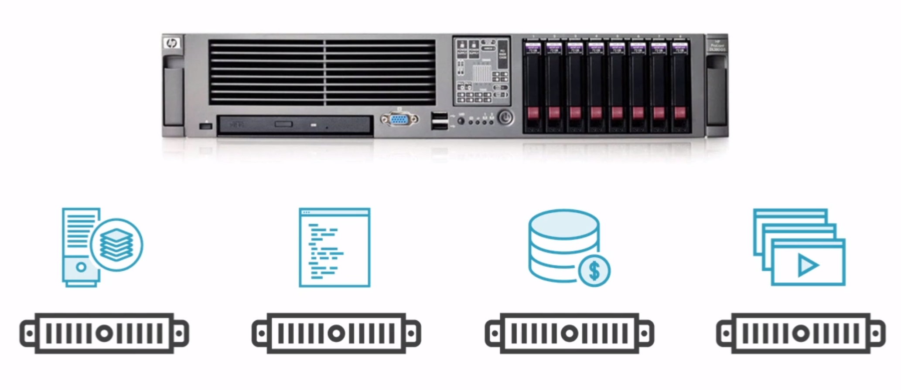
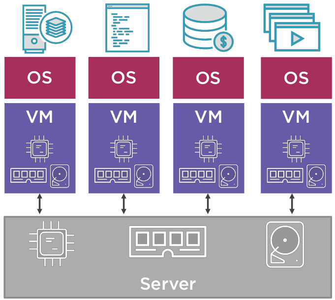
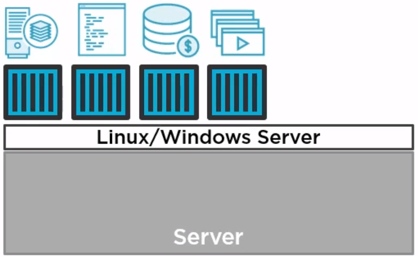

# En grundläggande kurs i Docker

```
 ____             _                
|  _ \  ___   ___| | _____ _ __  
| | | |/ _ \ / __| |/ / _ \ '__| 
| |_| | (_) | (__|   <  __/ |   
|____/ \___/ \___|_|\_\___|_|   

```
##### presenterad av Dominic Chan, dominic.chan@knowit.se

---

Mentimeter - gå till menti.com och ange koden: 5766 0519

---

| Deltagare 	| AWS host                                            	|
|-----------	|-----------------------------------------------------	|
| Azeb      	| ec2-13-53-44-108.eu-north-1.compute.amazonaws.com   	|
| Dennis    	| ec2-13-53-184-21.eu-north-1.compute.amazonaws.com   	|
| Erik      	| ec2-16-170-216-232.eu-north-1.compute.amazonaws.com 	|
| Emelie    	| ec2-13-49-229-251.eu-north-1.compute.amazonaws.com  	|
| Johan B   	| ec2-13-53-155-119.eu-north-1.compute.amazonaws.com  	|
| Johan Å   	| ec2-13-48-134-18.eu-north-1.compute.amazonaws.com   	|
| Jonathan  	| ec2-13-48-124-40.eu-north-1.compute.amazonaws.com   	|
| Patrik    	| ec2-13-53-218-63.eu-north-1.compute.amazonaws.com   	|
| Simon     	| ec2-13-53-145-213.eu-north-1.compute.amazonaws.com  	|
| Sofie     	| ec2-13-48-131-179.eu-north-1.compute.amazonaws.com  	|
| Louise B  	| ec2-16-170-207-168.eu-north-1.compute.amazonaws.com 	|
| Louise J  	| ec2-13-51-44-60.eu-north-1.compute.amazonaws.com    	|
| Josefine  	| ec2-13-49-158-118.eu-north-1.compute.amazonaws.com  	|
| Emil Ö    	| ec2-13-50-107-162.eu-north-1.compute.amazonaws.com  	|
| Emil T    	| ec2-13-50-99-19.eu-north-1.compute.amazonaws.com    	|
| Olof      	| ec2-13-49-231-85.eu-north-1.compute.amazonaws.com   	|
| Frida     	| ec2-13-50-15-132.eu-north-1.compute.amazonaws.com   	|
| Jennifer  	| ec2-13-53-235-48.eu-north-1.compute.amazonaws.com   	|
| John      	| ec2-16-170-35-127.eu-north-1.compute.amazonaws.com  	|
| Extra 1   	| ec2-13-50-112-143.eu-north-1.compute.amazonaws.com  	|
| Extra 2   	| ec2-16-170-209-3.eu-north-1.compute.amazonaws.com   	|
| Extra 3   	| ec2-16-170-168-6.eu-north-1.compute.amazonaws.com   	|
| Extra 4   	| ec2-13-50-105-96.eu-north-1.compute.amazonaws.com   	|
| Extra 5   	| ec2-13-51-45-123.eu-north-1.compute.amazonaws.com   	|
| Extra 6   	| ec2-13-53-184-14.eu-north-1.compute.amazonaws.com   	|

---

# Vad är Docker?

- Containrar är som snabba och lättviktiga virtuella maskiner.
- Docker gör det enkelt att bygga och köra våra applikationer i containrar.

 
---

# Bare metal



---

# Virtual Machines



---

# Containers



---

# VMs vs. Containers
&nbsp;&nbsp;&nbsp;&nbsp;&nbsp;&nbsp;&nbsp;&nbsp;&nbsp;&nbsp;&nbsp;&nbsp;&nbsp;&nbsp;&nbsp;&nbsp;


---

# Installera Docker på Ubuntu 22.04
Följande länk på DigitalOcean visar hur Docker Engine installeras på Ubuntu [Länk](https://www.digitalocean.com/community/tutorials/how-to-install-and-use-docker-on-ubuntu-22-04).

`sudo apt install docker-ce`

---

# Bygg en Docker containerimage från Dockerfile

Kör kommandot `docker build -t docker-demo-app .`

Docker kommer att per default att leta efter Dockerfile. Om du vill specificera filen kör då kommandot `docker build -f Dockerfile -t docker-demo-app .`

---

# Kör igång Docker container

Använd kommandot `docker run -d -p 8080:80 docker-demo-app`

---

# Visa alla containrar som körs

Använd kommandot `docker ps -a`

---

# Gör ett testanrop till docker-demo-app containern

Använd kommandot `curl localhost:8080`

---

# Stoppa docker-demo-app containern

Använd kommandot `docker stop <container-id>`

---

# Rensa alla stoppade containrar

Använd kommandot `docker system prune` och svara `ja` för att bekräfta

---

# Ladda ned container image från Dockerhub

Använd kommandot `docker pull busybox`

---

# Visa alla container images som finns sparat lokalt

Använd kommandot `docker images`

---

# Ta bort container image som finns sparat lokalt

Använd kommandot `docker rmi <imageid>`

---

# Övningar:
1. Starta container imagen bkimminich/juice-shop som lyssnar på port 3000.
2. Testa att containern bkimminich/juice-shop körs.
3. Stoppa containern som du startade i steg 1.

---


# Avslut och utvärdering:

Mentimeter - gå till menti.com och ange koden: 2179 658 

---
